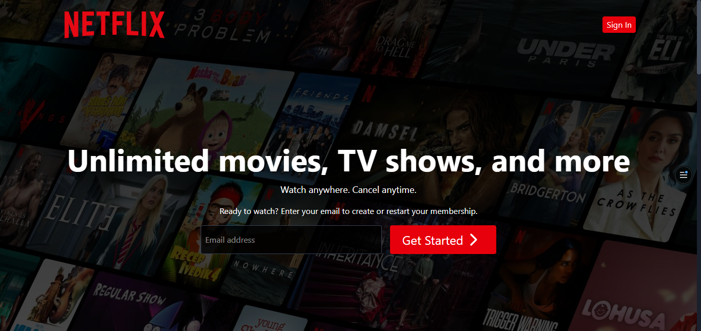

# 🎬 Netflix Clone (Full-Stack) 🚀

[](https://opensource.org/licenses/MIT)
[](https://reactjs.org/)
[](https://nodejs.org/)
[](https://www.mongodb.com/)
[](https://tailwindcss.com/)
[](https://netflix-alpha-gules.vercel.app/)

> Build fast, scalable, and interactive web apps effortlessly 🚀

---

## 📸 Screenshots
 

---

## 🌟 Features

| Feature | Description |
|---------|-------------|
| ⚛️ Tech Stack | React.js, Node.js, Express.js, MongoDB, Tailwind CSS |
| 🔐 Authentication | JWT-based login & registration |
| 📱 Responsive UI | Mobile & desktop friendly |
| 🎬 Movies & TV Shows | Browse popular content |
| 🔎 Search | Search for actors & movies |
| 🎥 Trailers | Watch trailers directly |
| 🔥 Search History | Fetch & display search history |
| 🐱‍👤 Similar Content | Recommend similar movies/TV shows |
| 💙 Landing Page | Modern interactive UI |
| ✅ Deployment-ready | Vercel-ready frontend & backend setup |
| 🚀 Project Management | Multi-workspace support & task management |

---

## 🛠 Tech Stack

**Frontend:** React, Tailwind CSS, React Router, Redux, Recharts  
**Backend:** Node.js, Express  
**Database:** MongoDB (Atlas or local)  
**Authentication:** JWT  

---

## ⚡ Installation

1. **Clone the repository**
```bash
git clone https://github.com/hilla10/netflix-clone.git
cd netflix-clone
```

2, ** Install dependencies **
```bash

# Frontend
cd frontend
npm install

# Backend
cd ../backend
npm install
```

3, *** Configure environment ***

# Backend .env
```bash
MONGO_URI=your_mongo_db_uri
JWT_SECRET=your_jwt_secret
PORT=3000
NODE_ENV=development
TMDB_API_KEY='your_tmdb_api_key'
FRONTEND_URL=your_frontend_url
```
# Frontend .env
```bash
VITE_API_URL=http://localhost:3000
```
4, *** Run the project ***
# Backend
```bash
cd backend
npm run dev
```

# Frontend
```bash
cd frontend
npm run dev
```

## 🗂 Folder Structure
```bash
netflix-clone/
├─ backend/
│  ├─ config/
│  ├─ controllers/
│  ├─ models/
│  ├─ routes/
│  ├─ middlewares/
│  ├─ utils/
│  ├─ service/
│  ├─ server.js
│  └─ .env
├─ frontend/
│  ├─ src/
│  │  ├─ components/
│  │  ├─ pages/
│  │  ├─ store/
│  │  └─ App.jsx
│  ├─ vite.config.js
│  └─ package.json
└─ README.md
```

## 🤝 Contributing

1, Fork the repository

2, Create a feature branch: git checkout -b feature/new-feature

3, Commit your changes: git commit -m "Add feature"

4, Push to your branch: git push origin feature/new-feature

5, Open a Pull Request

## 📄 License

MIT © Hailemichael Negusse

##📫 Contact

GitHub: hilla10

Portfolio:[ portfolio.com](https://portfolio-rho-gules-15.vercel.app/)
